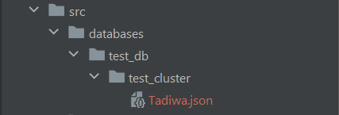

Author: [ 🧑‍💻Tadiwanashe Shangwa - Codapt Co-founder](https://github.com/Tadiwr)

### Documentation
- [Captive Docs 📄](dev/codapt/captive.kt/lib/documentation/REAME.md)

## What is Captive DB?
Captive DB is a Kotlin library for creating a managing
local NO-SQL document based databases, like Mongo DB. It is currently available
Kotlin but there are plans to provide the library for other languages!

## Why Captive DB
The idea for Captive DB come about after I faced some challenges trying
to connect my [Ktor](https://github.com/ktorio/ktor) Backend to a Mongo DB
client. I couldn't find a simple Mongo DB client so as [Codapt](https://github.com/codaptdev)
we decided to create our own library to solve this problem

- Captive DB is simple to use, all the complexity is encapsulated into the library's
  classes and files which means you don't have to write a million lines of code to
  set up your database
- Captive DB sets up a database on your local machine which means you have
  direct control over your database, rather than using a remote database. There
  is no more need to have to install a Mongo DB client then add the connection string just to set up
  a database


    Please note that Captive DB is still in developement, if you face any 
    challanges please let us know!. It is also not yet available as a 
    package but in future it will be. Thank you 🙏

### Add the Kotlin Serialization Library
```` Kotlin
implementation("org.jetbrains.kotlinx:kotlinx-serialization-json:1.4.1")
````
- This is used by the Captive Library !

### Add Plugin
```` Kotlin
kotlin("plugin.serialization") version "1.7.21"
````

### Set up Database
````Kotlin
// Creates a database directory at ./src/database/test_db
val db = Database("test db", "./src/databases")
````

### Create Cluster
````Kotlin
// Creates a database directory at ./src/database/test_db
val db = Database("test db", "./src/databases")

// Creates cluster inside the database path above
val testCluster = db.createCluster("test cluster")
````

### Create a document

````Kotlin
// Create a serializable class you want to write to your document
@Serializable
data class User(
    val name: String,
    val age: Int,
    val gender: Char
)
````

````Kotlin
// Creates a database directory at ./src/database/test_db
val db = Database("test db", "./src/databases")

// Creates cluster inside the database path above
val testCluster = db.createCluster("test cluster")

val user = User(
    name = "Tadiwa",
    age =  25,
    gender = 'M'
)

// Creating a document
testCluster.addDocument(serializable = user, docName = user.name)
````

### Results


And if we step into the file Tadiwa.json we can see that our User object
was serialized into json string.
````json
{"name":"Tadiwa","age":25,"gender":"M"}
````
This is all done for you and Captive DB does a great job
of hiding the complexity for you so that you focus on what matters

### Thank you, any feedback 👇
[👋 Codapt on Instagram](https://instagram.com/codaptdev)

[ 🕊️ Tadiwa on Twitter](https://twitter.com/tadiwrr)

